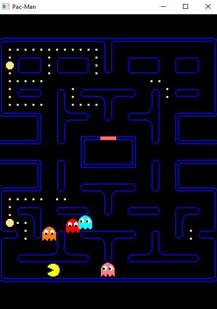
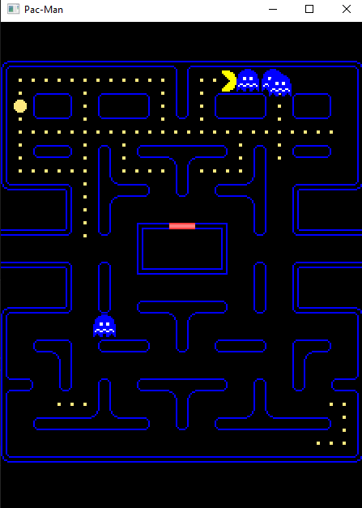

# Pac-Man
A classic Pac-Man game using C++ and a graphics library such as SFML (Simple and Fast Multimedia Library). Pac-Man is a beloved arcade game where players navigate Pac-Man through a maze, eating dots while avoiding ghosts.

